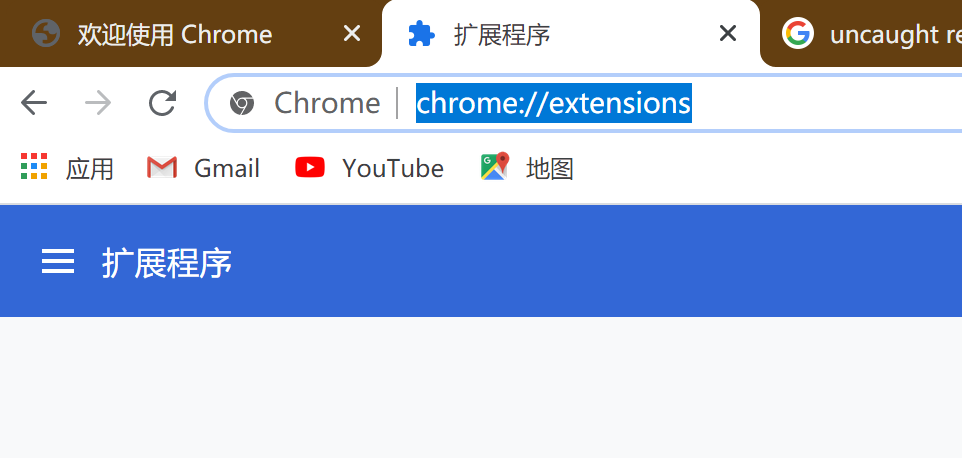
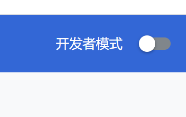
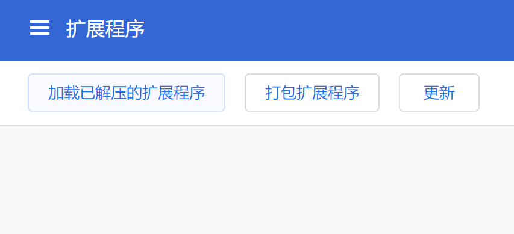
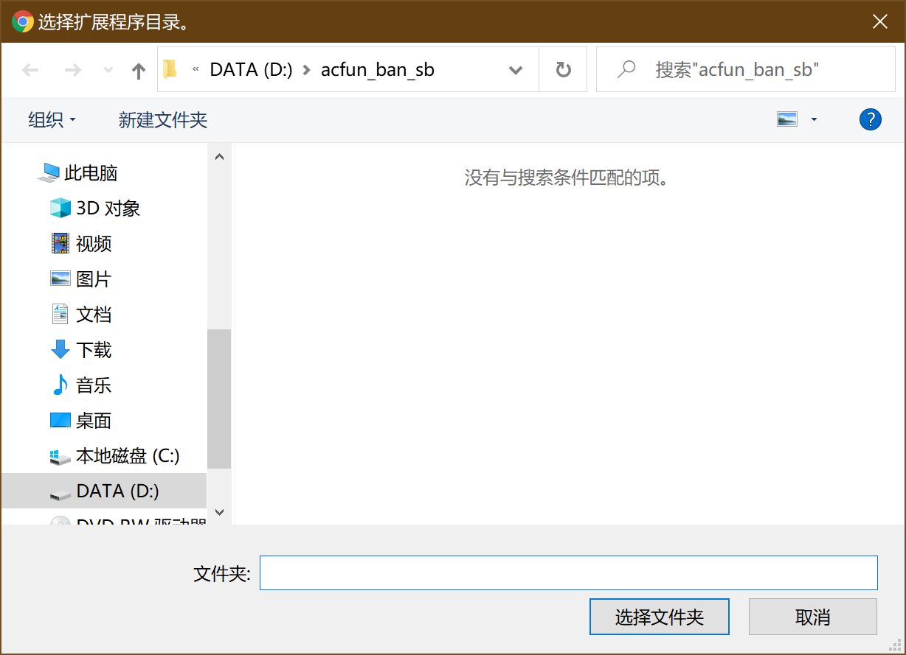
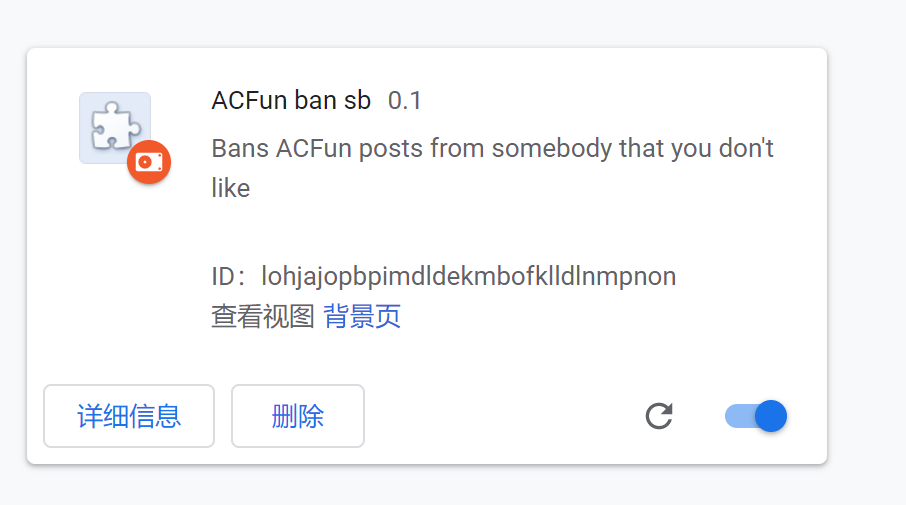
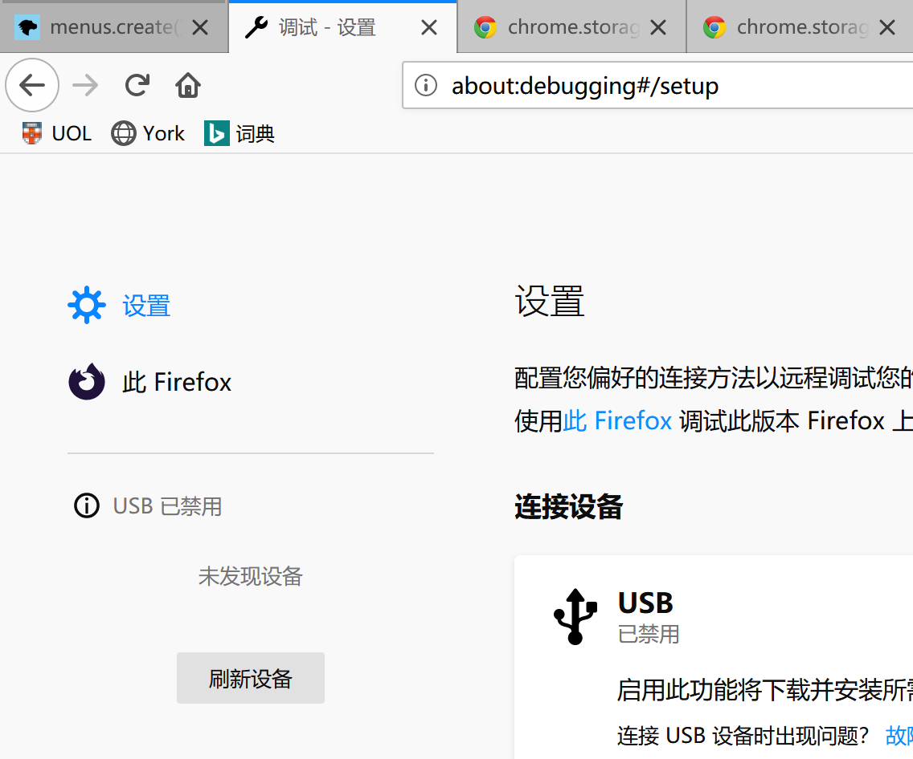
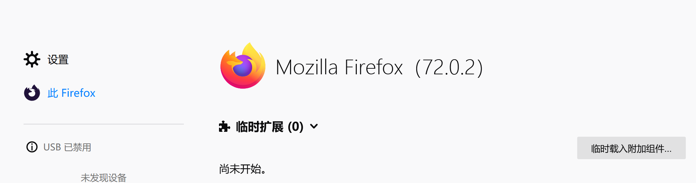
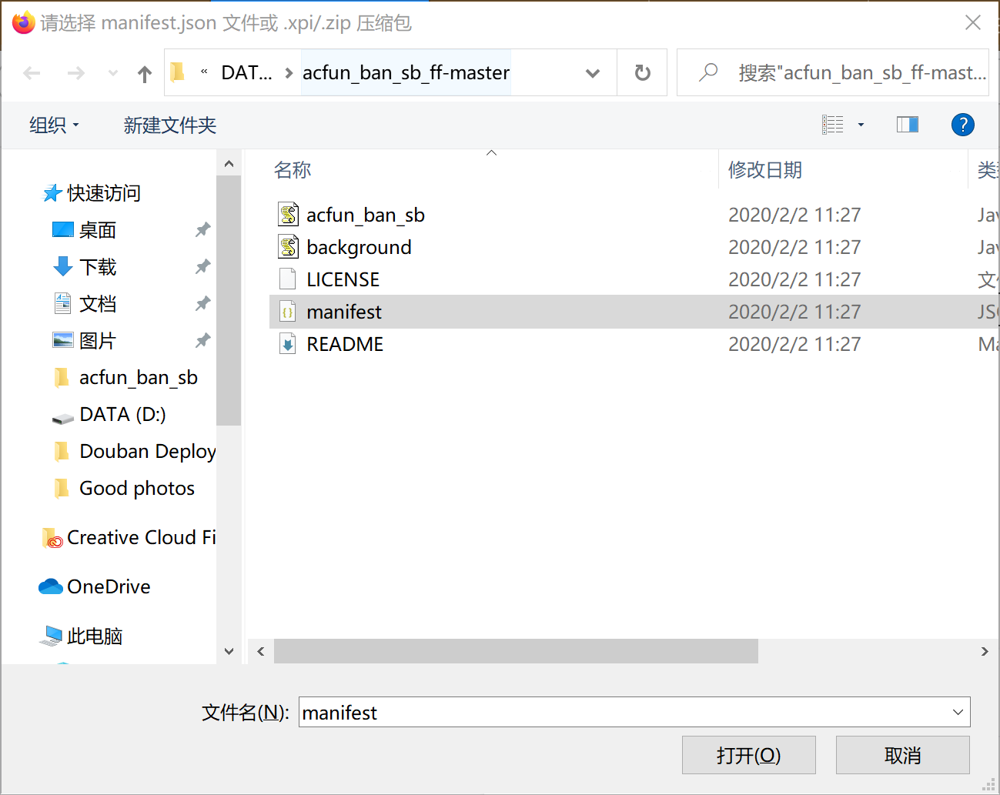
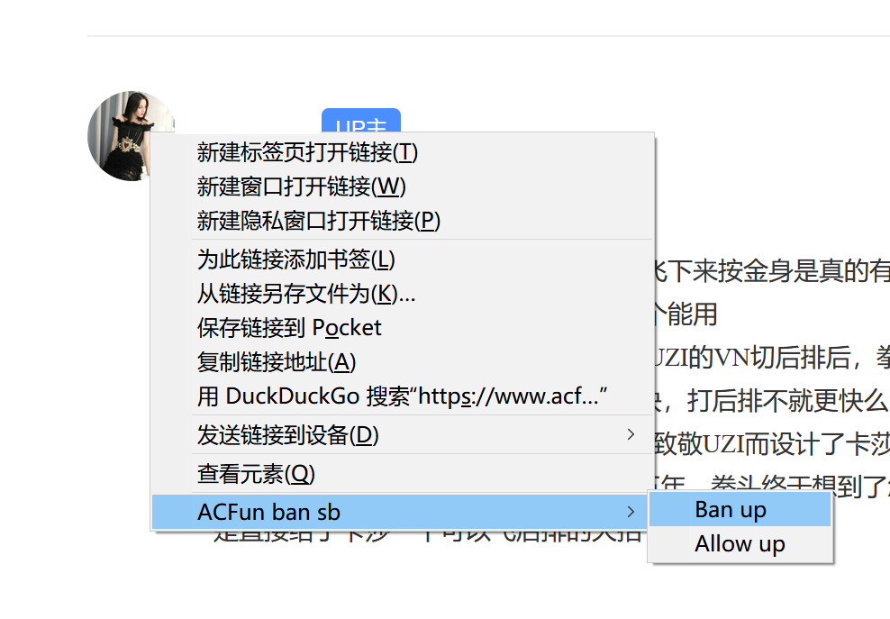
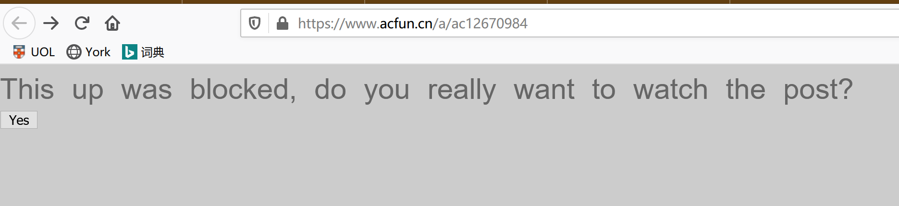

# ACFun ban somebody

A firefox/chrome extension that implements missing banlist for ACfun.

ACFun is a Chinese website for anime, comic and games. Users can post videos or articles and view others' post. While the site is always filled with fun and love, in some cases we may no longer want to see somebody's post any more. But there's no such "block" or "banlist" functionality for now. This plugin implements a banlist. If user opens a post created by somebody on the banlist, the page will be covered by a dialog asking confirmation.

I open sourced this extension to make everything auditable. So that everyone can feel safe to install and use.

AC在，爱一直在

实现了 ACFun 缺失的拉黑 up 主功能。如果手滑点进被拉黑过的人发布的文章，插件会遮盖文章，并要求确认是否访问。

代码完全开源，请诸君放心使用。

## Chrome 安装
由于还没有打包 launch，请选择 “clone or download”，“download as zip”，然后按照如下步骤操作：
1. 打开 chrome://extensions

2. 启用开发者模式

3. 选择 “加载已解压的扩展程序”

4. 找到 zip 解压的位置，打开文件夹，一片空白，但不要方，选择文件夹

OK，装载完毕

## Firefox 安装
由于还没有打包 launch，请选择 “clone or download”，“download as zip”，然后按照如下步骤操作：
1. 打开 about:debugging

2. 选择 “此 Firefox”

3. 选择 “临时载入附加组件”，找到 zip 解压的位置，然后选中 manifest

OK，装载完毕

## 使用
1. 见到了不太对劲的文章，右键点选 Up 主头像，将此人 ban 掉

2. 刷新，或当你再次不小心点进这个人发表的文章后，会变成这个亚子。点下 Yes 后会显示出原本的内容，

3. 如果此人改邪归正了，可以按相反的方法把他放出来。

## TODO
1. i18n 支持，远离工地英语
2. 目前 storage 是 local，需要改成 sync，这样可以支持多个浏览器同步
3. 快点整理一下，部署到 Firefox 和 Chrome 商店，这样安装步骤会简单很多
